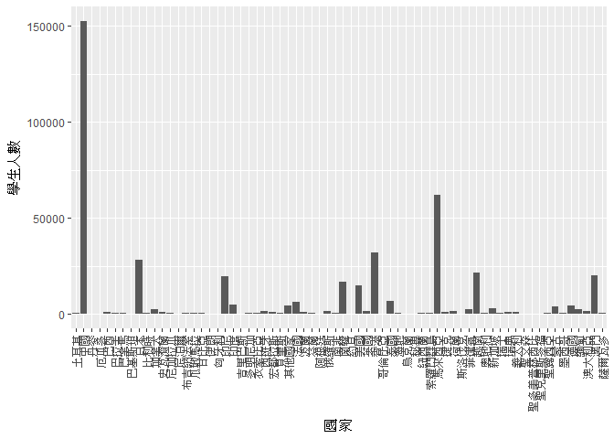
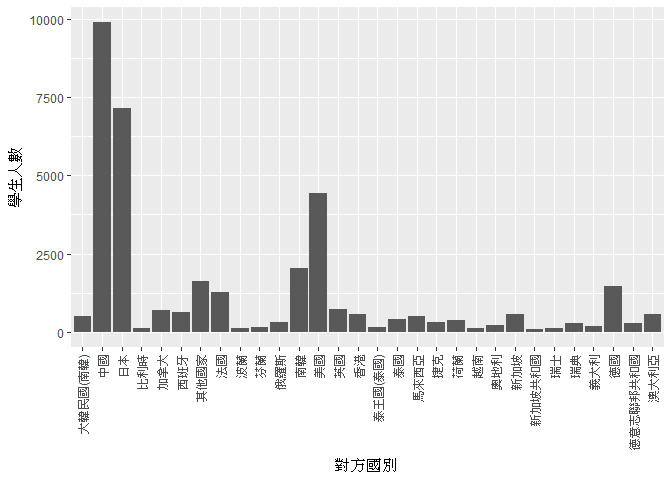
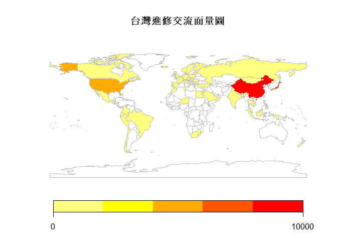

106-2 大數據分析方法 作業二
================
機械四 蕭瑋彤 B0322036

作業完整說明[連結](https://docs.google.com/document/d/1aLGSsGXhgOVgwzSg9JdaNz2qGPQJSoupDAQownkGf_I/edit?usp=sharing)

學習再也不限定在自己出生的國家，台灣每年有許多學生選擇就讀國外的大專院校，同時也有人多國外的學生來台灣就讀，透過分析[大專校院境外學生人數統計](https://data.gov.tw/dataset/6289)、[大專校院本國學生出國進修交流數](https://data.gov.tw/dataset/24730)、[世界各主要國家之我國留學生人數統計表](https://ws.moe.edu.tw/Download.ashx?u=C099358C81D4876CC7586B178A6BD6D5062C39FB76BDE7EC7685C1A3C0846BCDD2B4F4C2FE907C3E7E96F97D24487065577A728C59D4D9A4ECDFF432EA5A114C8B01E4AFECC637696DE4DAECA03BB417&n=4E402A02CE6F0B6C1B3C7E89FDA1FAD0B5DDFA6F3DA74E2DA06AE927F09433CFBC07A1910C169A1845D8EB78BD7D60D7414F74617F2A6B71DC86D17C9DA3781394EF5794EEA7363C&icon=..csv)可以了解103年以後各大專院校國際交流的情形。請同學分析以下議題，並以視覺化的方式呈現分析結果，呈現103年以後大專院校國際交流的情形。

來台境外生分析
--------------

### 資料匯入與處理

``` r
library(readr)
library(jsonlite)
library(dplyr)
library(httr)
library(RCurl)
library(knitr)
library(rmarkdown)
library(rvest)
library(ggplot2)
library(choroplethr)
library(choroplethrMaps)
library(ggmap)
library(data.table)
library(plotly)
library(rworldmap)
#Qustion1-3 Country
Foreign_inTW_103_C <- read_csv("http://stats.moe.gov.tw/files/detail/103/103_ab103_C.csv")
Foreign_inTW_104_C <- read_csv("http://stats.moe.gov.tw/files/detail/104/104_ab104_C.csv")
Foreign_inTW_105_C <- read_csv("http://stats.moe.gov.tw/files/detail/105/105_ab105_C.csv")
Foreign_inTW_106_C <- read_csv("http://stats.moe.gov.tw/files/detail/106/106_ab105_C.csv")
col_Name_C <- c("州","國家","學位生-正式修讀學位外國生","學位生-僑生(含港澳)","學位生-正式修讀學位陸生",
                "非學位生-外國交換生","非學位生-外國短期研習及個人選讀","非學位生-大專附設華語文中心學生","非學位生-大陸研修生","非學位生-海青班","境外專班")
names(Foreign_inTW_103_C) <- col_Name_C 
names(Foreign_inTW_104_C) <- col_Name_C 
names(Foreign_inTW_105_C) <- col_Name_C 
names(Foreign_inTW_106_C) <- col_Name_C 
Foreign_inTW_ALL_C <- rbind(Foreign_inTW_103_C,Foreign_inTW_104_C) %>% rbind(Foreign_inTW_105_C,Foreign_inTW_106_C)
#Question1-3 School
Foreign_inTW_103_S <- read_csv("http://stats.moe.gov.tw/files/detail/103/103_ab103_S.csv")
Foreign_inTW_104_S <- read_csv("http://stats.moe.gov.tw/files/detail/104/104_ab104_S.csv")
Foreign_inTW_105_S <- read_csv("http://stats.moe.gov.tw/files/detail/105/105_ab105_S.csv")
Foreign_inTW_106_S <- read_csv("http://stats.moe.gov.tw/files/detail/106/106_ab105_S.csv")
col_Name_S <- c("學校類型","學校代碼","學校名稱","學位生-正式修讀學位外國生","學位生-僑生(含港澳)","學位生-正式修讀學位陸生",
                "非學位生-外國交換生","非學位生-外國短期研習及個人選讀","非學位生-大專附設華語文中心學生","非學位生-大陸研修生","非學位生-海青班","境外專班")
names(Foreign_inTW_103_S) <- col_Name_S
names(Foreign_inTW_104_S) <- col_Name_S
names(Foreign_inTW_105_S) <- col_Name_S
names(Foreign_inTW_106_S) <- col_Name_S
Foreign_inTW_ALL_S <- rbind(Foreign_inTW_103_S,Foreign_inTW_104_S) %>% rbind(Foreign_inTW_105_S,Foreign_inTW_106_S)
Foreign_inTW_ALL_S$`非學位生-大陸研修生` <- ifelse(Foreign_inTW_ALL_S$`非學位生-大陸研修生`== "…",0,Foreign_inTW_ALL_S$`非學位生-大陸研修生`) %>% as.numeric()
#question 1-3
Foreign_inTW_ALL_C$studentNumber <- rowSums(Foreign_inTW_ALL_C[,3:11]) 
Foreign_inTW_ALL_S$studentNumber <- rowSums(Foreign_inTW_ALL_S[,4:12])
Foreign_inTW_ALL_C <- data.table(Foreign_inTW_ALL_C)
Foreign_inTW_ALL_S <- data.table(Foreign_inTW_ALL_S)

Student_country <- Foreign_inTW_ALL_C[,.(`學生人數` = sum(studentNumber)),by= `國家`] %>% arrange(desc(`學生人數`)) #外國學生全部資料
Student_country$國家[1] <- "中國"
Question3Data <- Student_country
#make people less 200 into others
Question2Data<- Student_country[1:67,]
a <- c("其他國家" ,4494)
Question2Data <- rbind(Question2Data,a)
Question2Data$學生人數 <- as.numeric(Question2Data$學生人數)

Student_countryTOP10 <- Student_country %>% head(10) #國家取前10名
Student_School <- Foreign_inTW_ALL_S[,.(`學生人數` = sum(studentNumber)),by= `學校名稱`] %>% arrange(desc(`學生人數`)) #本國學生全部資料
Student_SchoolTOP10 <- Student_School %>% head(10) #學校取前10名

countrycodelist <- fromJSON("https://gist.githubusercontent.com/jacobbubu/060d84c2bdf005d412db/raw/845c78f55e49fee89814bdc599355069f07b7ee6/countries.json")
countrycodelist <- countrycodelist[,c(2,5,7)]
countrycodelist[48,3] <- "中國"
unknownSchool <- Foreign_inTW_ALL_S[c(304,458,612),] #不分區學校資料
```

### 哪些國家來台灣唸書的學生最多呢？

前三名分別為中國、馬來西亞和香港，前五名皆為亞洲地區國家。

``` r
knitr::kable(Student_countryTOP10)
```

| 國家     | 學生人數 |
|:---------|:--------:|
| 中國     |  152524  |
| 馬來西亞 |   62031  |
| 香港     |   31940  |
| 日本     |   28200  |
| 越南     |   21670  |
| 澳門     |   20302  |
| 印尼     |   19620  |
| 南韓     |   16948  |
| 美國     |   14846  |
| 泰國     |   7035   |

### 哪間大學的境外生最多呢？

第一名和第二名分別是：國立師範大學和國立台灣大學，第一名是台灣師範大學是可以理解的，因為師大有世界有名的中文教學中心，因此有台灣最多的外國學生，應該都是去師範大學學習中文的外國學生。

``` r
knitr::kable(Student_SchoolTOP10)
```

| 學校名稱         | 學生人數 |
|:-----------------|:--------:|
| 無法區分校別     |   92586  |
| 國立臺灣師範大學 |   22113  |
| 國立臺灣大學     |   18199  |
| 中國文化大學     |   16074  |
| 銘傳大學         |   16057  |
| 淡江大學         |   13887  |
| 國立政治大學     |   11626  |
| 國立成功大學     |   10982  |
| 輔仁大學         |   9499   |
| 逢甲大學         |   9474   |

但看到是無法區分校別的人數最多，讓我覺得十分好奇，於是去找了之後發現

``` r
knitr::kable(unknownSchool)
```

| 學校類型 | 學校代碼 | 學校名稱     | 學位生-正式修讀學位外國生 | 學位生-僑生(含港澳) | 學位生-正式修讀學位陸生 | 非學位生-外國交換生 | 非學位生-外國短期研習及個人選讀 | 非學位生-大專附設華語文中心學生 | 非學位生-大陸研修生 | 非學位生-海青班 | 境外專班 |  studentNumber|
|:---------|:---------|:-------------|:-------------------------:|:-------------------:|:-----------------------:|:-------------------:|:-------------------------------:|:-------------------------------:|:-------------------:|:---------------:|:--------:|--------------:|
| 無       | 9999     | 無法區分校別 |             0             |          0          |            0            |          0          |                0                |                0                |        34114        |        0        |     0    |          34114|
| 無       | 9999     | 無法區分校別 |             0             |          0          |            0            |          0          |                0                |                0                |        32648        |        0        |     0    |          32648|
| 無       | 9999     | 無法區分校別 |             0             |          0          |            0            |          0          |                0                |                0                |        25824        |        0        |     0    |          25824|

這9萬名學生的組成全部都是大陸研修生，代表在台灣有超過9萬名陸生根本不知道他是去哪所學校，這真的十分有趣。

### 各個國家來台灣唸書的學生人數條狀圖

人數最多的國家是中國。

``` r
ggplot(data = Question2Data)+
  geom_bar(aes(x = `國家`,y = `學生人數`),stat = "identity") + 
  theme(axis.text.x = element_text(angle = 90, size = 9, hjust = 1,vjust = 0.5))
```



### 各個國家來台灣唸書的學生人數面量圖

會發現顏色較深色的區域皆在亞洲，可知大部分來台讀書的學生是從亞洲地區國家來的，不過從圖中也可以發現幾乎全世界國家都有學生來台灣念書。

``` r
for (i in 1:nrow(Question3Data)){
  for (j in 1:nrow(countrycodelist)){
    if (Question3Data$`國家`[i] == countrycodelist$Taiwan[j]){
      Question3Data$ISO3[i] = countrycodelist$ISO3[j]
    }
  }
}
question3Plot <- joinCountryData2Map(Question3Data, joinCode="ISO3", nameJoinColumn="ISO3")
```

    ## 177 codes from your data successfully matched countries in the map
    ## 0 codes from your data failed to match with a country code in the map
    ## 92 codes from the map weren't represented in your data

``` r
mapCountryData(question3Plot , nameColumnToPlot="學生人數", mapTitle="外國學生來台人數與國家面量圖", catMethod = "pretty", colourPalette = "heat",lwd = 0.01)
```


台灣學生國際交流分析
--------------------

### 資料匯入與處理

``` r
Question4Data2 <- read.csv("~/GitHub/106bigdatacguimhw2-mctony999/Question4Data2.csv", stringsAsFactors=FALSE)
Question4Data2 <- data.table(Question4Data2)
Question4Data2$`對方國別` <- ifelse(Question4Data2$`對方國別` == "大陸地區","中國大陸",Question4Data2$對方國別)
TWStudent_country <- Question4Data2[,.(`學生人數` = sum(`總計`)),by= `對方國別`] %>%
  arrange(desc(`學生人數`))
TWStudent_country$`對方國別`[1] <- "中國"
Question6Data<- TWStudent_country
#question5
Question5Data <- TWStudent_country[1:29,]
a <- c("其他國家" ,1629)
Question5Data <- rbind(Question5Data,a)
Question5Data$`學生人數` <- as.numeric(Question5Data$`學生人數`)

TWStudent_countryTOP10 <-TWStudent_country %>% head(10)
TWStudent_SchoolTOP10 <- Question4Data2[,.(學生人數 = sum(`總計`)),by= `學校名稱`] %>%
  arrange(desc(`學生人數`)) %>% head(10)
```

### 台灣大專院校的學生最喜歡去哪些國家進修交流呢？

前三名為中國、日本與美國。

``` r
knitr::kable(TWStudent_countryTOP10)
```

| 對方國別 | 學生人數 |
|:---------|:--------:|
| 中國     |   9891   |
| 日本     |   7142   |
| 美國     |   4427   |
| 南韓     |   2050   |
| 德國     |   1466   |
| 法國     |   1258   |
| 英國     |    742   |
| 加拿大   |    689   |
| 西班牙   |    642   |
| 香港     |    572   |

### 哪間大學的出國交流學生數最多呢？

第一名是國立台灣大學，與預期相同因為是全台灣資金與資源最多的學校。

``` r
knitr::kable(TWStudent_SchoolTOP10)
```

| 學校名稱     | 學生人數 |
|:-------------|:--------:|
| 國立臺灣大學 |   2224   |
| 淡江大學     |   2038   |
| 國立政治大學 |   1876   |
| 逢甲大學     |   1346   |
| 元智大學     |   1106   |
| 國立臺北大學 |    956   |
| 國立交通大學 |    951   |
| 東海大學     |    931   |
| 東吳大學     |    873   |
| 國立成功大學 |    846   |

### 台灣大專院校的學生最喜歡去哪些國家進修交流條狀圖

人數最高的是中國，再來是日本，最後是美國。

``` r
ggplot(data = Question5Data) +
  geom_bar(aes(x = `對方國別`, y = `學生人數`),stat = "identity") + 
  theme(axis.text.x = element_text(angle = 90, size = 9, hjust = 1,vjust = 0.5))
```



### 台灣大專院校的學生最喜歡去哪些國家進修交流面量圖

``` r
for (i in 1:nrow(Question6Data)){
  for (j in 1:nrow(countrycodelist)){
    if (Question6Data$`對方國別`[i] == countrycodelist$Taiwan[j]){
      Question6Data$ISO3[i] = countrycodelist$ISO3[j]
    }
  }
}
question6Plot <- joinCountryData2Map(Question6Data, joinCode="ISO3", nameJoinColumn="ISO3")
```

    ## 115 codes from your data successfully matched countries in the map
    ## 0 codes from your data failed to match with a country code in the map
    ## 171 codes from the map weren't represented in your data

``` r
mapCountryData(question6Plot , nameColumnToPlot="學生人數", mapTitle="台灣進修交流面量圖", catMethod = "pretty", colourPalette = "heat",lwd = 0.01)
```



台灣學生出國留學分析
--------------------

### 資料匯入與處理

``` r
#Qestion 7-8
Question7Data <- read_csv("a.csv")
Question7Data <- Question7Data[,1:3] %>% data.table()
Question7Top10 <- arrange(Question7Data,desc(`總人數`)) %>% head(10)
```

### 台灣學生最喜歡去哪些國家留學呢？

台灣學生最喜歡去留學的地方前三名，分別為美國、澳洲與日本。

``` r
knitr::kable(Question7Top10)
```

| 洲別   | 國別     | 總人數 |
|:-------|:---------|:------:|
| 美洲   | 美國     |  21127 |
| 大洋洲 | 澳大利亞 |  13582 |
| 亞洲   | 日本     |  8444  |
| 美洲   | 加拿大   |  4827  |
| 歐洲   | 英國     |  3815  |
| 歐洲   | 德國     |  1488  |
| 大洋洲 | 紐西蘭   |  1106  |
| 歐洲   | 波蘭     |   561  |
| 亞洲   | 馬來西亞 |   502  |
| 歐洲   | 奧地利   |   419  |

### 台灣學生最喜歡去哪些國家留學面量圖

``` r
for (i in 1:nrow(Question7Data)){
  for (j in 1:nrow(countrycodelist)){
    if (Question7Data$`國別`[i] == countrycodelist$Taiwan[j]){
      Question7Data$ISO3[i] = countrycodelist$ISO3[j]
    }
  }
}
question8Plot <- joinCountryData2Map(Question7Data, joinCode="ISO3", nameJoinColumn="ISO3")
```

    ## 29 codes from your data successfully matched countries in the map
    ## 0 codes from your data failed to match with a country code in the map
    ## 217 codes from the map weren't represented in your data

``` r
mapCountryData(question8Plot , nameColumnToPlot="總人數", mapTitle="台灣出國留學國家面量圖", catMethod = "pretty", colourPalette = "heat",lwd = 0.01)
```

    ## You asked for 7 categories, 5 were used due to pretty() classification


綜合分析
--------

請問來台讀書與離台讀書的來源國與留學國趨勢是否相同(5分)？想來台灣唸書的境外生，他們的母國也有很多台籍生嗎？請圖文並茂說明你的觀察(10分)。

來台讀書與離台讀書的來源國與留學國趨勢並不相同，由以下兩張面量圖就可發現，來台灣念書最主要的國家來自亞洲地區，如中國與東南亞國家，而台灣出國留學大部分都選擇美國、澳洲或歐洲等地學校，只有少部分選擇亞洲國家留學。

``` r
mapCountryData(question3Plot , nameColumnToPlot="學生人數", mapTitle="外國學生來台人數與國家面量圖", catMethod = "pretty", colourPalette = "heat",lwd = 0.01)
```

    ## You asked for 7 categories, 8 were used due to pretty() classification


``` r
mapCountryData(question8Plot , nameColumnToPlot="總人數", mapTitle="台灣出國留學國家面量圖", catMethod = "pretty", colourPalette = "heat",lwd = 0.01)
```

    ## You asked for 7 categories, 5 were used due to pretty() classification


因此可知大部分有很多學生來台灣念書的國家，其本土也有很多台灣學生的國家是很少的。只有日本一個國家來台學生很多，且在日本本土的台灣學生也很多，由下表可知，來台日本人有28200人是在台灣外國人數排名中的第四名，而在日台灣人有8444人，是台灣出國留學人數排名中的第三名，兩者排名相當。

在日本留學之台灣人
------------------

``` r
knitr::kable(Question7Top10[3,])
```

|     | 洲別 | 國別 | 總人數 |
|-----|:-----|:-----|:------:|
| 3   | 亞洲 | 日本 |  8444  |

在台灣留學之日本人
------------------

``` r
knitr::kable(Student_countryTOP10[4,])
```

|     | 國家 | 學生人數 |
|-----|:-----|:--------:|
| 4   | 日本 |   28200  |
